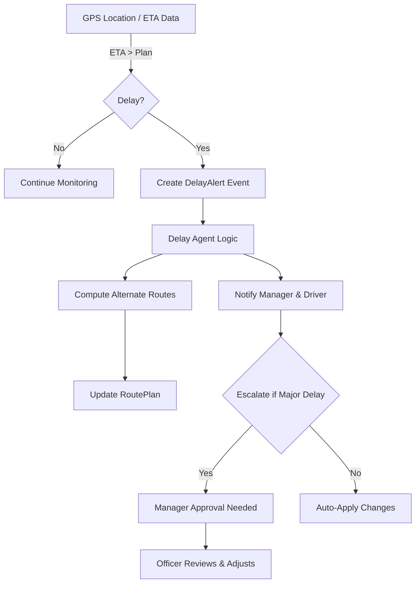
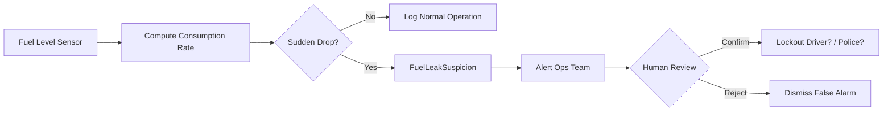

# Executive Summary  
ABC Express should build an ontology-driven **AI agentic operating system** (a real-time “digital twin”) that unifies sensor data and business systems to automate operations and decision-making.  By instrumenting trucks, warehouses, and processes with IoT (e.g. GPS/telematics, fuel gauges, axle-load cells, door/temp sensors, cameras, RFID, etc.), we map each to our ontology (e.g. *Truck*, *Shipment*, *Warehouse* objects with attributes like location, fuel level, load weight).  An event engine then drives state transitions (Trip-Planned→EnRoute→Delayed→Completed, Truck-Idle→Assigned→InMaintenance, etc.), and specialized AI agents (Dispatch, Delay, Fuel‑Theft, Predictive Maintenance, Loading, Finance, Branch Performance) monitor these events.  Each agent has defined inputs (sensor streams, schedules, logs), outputs (alerts, commands, tickets) and decision logic with confidence thresholds and human-review gates.  

For example, a *Delay Agent* compares live GPS data to planned ETAs and, if a route is forecast late, automatically triggers rerouting and alerts operations staff.  A *Fuel‑Leak Agent* flags rapid fuel-drop events vs expected consumption and escalates for investigation.  Such automation can dramatically reduce costs: studies show IoT fuel monitors alone stop losses and save fuel【11†L239-L247】【44†L289-L298】, while real-time tracking and predictive alerts sharply cut delays【30†L167-L174】【44†L214-L223】.  Piloting just three “quick-win” features – GPS tracking with ETA alerts, fuel-theft detection, and a branch performance dashboard – will immediately boost ROI (fuel savings, on-time metrics【11†L239-L247】【26†L61-L68】).  

Architecturally, the solution uses a **data integration layer** (IoT gateways, Kafka/MQTT streams, ERP/TMS connectors) feeding a **unified data fabric** (data lake/warehouse plus a graph/knowledge-base keyed by the logistics ontology).  A real-time processing engine (e.g. Kafka Streams or Apache Flink) and a workflow/orchestration engine (Camunda, Zeebe or Palantir Foundry AIP) handle event-state logic and agent coordination.  A **digital twin** front end (dashboards and APIs) visualises live state of assets and events【3†L111-L119】【28†L139-L148】.  Over a phased roadmap, we begin with core IoT telemetry and dashboards (Phase 1 MVP), then roll out advanced ML agents and cross-entity analytics (Phase 2+).  Throughout, we enforce data partitioning per legal entity (ABCE’s two subsidiaries) and Indonesian data-law compliance (PDP Law 2022, GDPR-like) via encryption, RBAC and audit trails.  Key KPIs (On-time %, Fuel efficiency, Maintenance downtime, Dock-turnaround, Cost/km, etc. 【26†L61-L68】) will be monitored on executive/manager dashboards.  

**Next steps:**  Form a pilot team, refine the ontology with domain experts (using the provided ABC ontology docs), install basic IoT devices on a subset of trucks and yard, and develop the first agents (e.g. Delay and Fuel Leak).  Validate with live data and iterate on thresholds.  Early wins (fuel and timeliness) will build momentum while we architect the full system for enterprise-wide deployment.

## Data & Ontology Inventory  
ABC Express already has rich internal data: order/route schedules in the TMS, ERP/finance records, HR/driver data, and (from the uploaded docs) a draft *ontology* of entities and relationships (“Memahami Ontology” & “Validation Kit”). We should align these with the IoT/operational data. For example, the *ontology* defines classes like *Driver*, *Truck*, *Order*, *Warehouse*, *Branch*, etc., and relationships (Driver–drives–Truck, Truck–assignedTo–Order, Order–destination–Warehouse) and events (e.g. *TripStarted*, *CargoUnloaded*).  Palantir’s model suggests modeling “real-world entities like factories, warehouses, shipments” and their triggers【28†L145-L148】. We will refine ABC’s ontology to include:  

- **Objects/Classes:** Truck, Trailer, Driver, Shipment/Load, Order, Depot/Warehouse, Branch/Hub, Route/Trip, FuelRefill, MaintenanceOrder, SparePartInventory, etc.  
- **Attributes:** e.g. *Truck*: {plateNo, type, capacity, fuelLevel, engineTemp, axleLoad, doorStatus, GPSLocation}; *Shipment*: {weight, volume, temperatureRequirement, status}; *Branch*: {location, performanceScore}.  
- **Relationships:** e.g. *Driver* **assignedTo** *Truck*; *Truck* **onRoute** *Trip*; *Shipment* **destinedFor** *Branch*; *Depot* **contains** *SparePartInventory*. This supports queries like “Which branch has 10% underutilized trucks?”  
- **Event Types:** We catalog events that change states. These include operational events (TripStarted, ArrivedAtDepot, CargoLoaded/Unloaded, MaintenanceCompleted), exceptions (DelayAlert, OverWeightAlarm, FuelLeakDetected, TempDeviation, DoorOpened), and financial (InvoiceIssued, CostAnomaly). Each sensor maps to one or more events – see next section.  

This ontology drives our state engine. For example, a **Trip** state machine might be: *Planned → Dispatched → EnRoute → (if delay triggers) Delayed → Completed or Cancelled*. A **Truck** has states Idle / Assigned / InTransit / Maintenance. We will encode these state models so that incoming events drive transitions. For instance, a GPS location update might trigger a Trip’s state to move from “EnRoute” to “ArrivedAtStop” or “Delayed” if off-schedule. (Palantir calls this an “ontology-driven digital twin”: every object’s real-time state is tracked and used to trigger workflows【28†L139-L148】【3†L111-L119】.)  

## Sensors & Real-World Mapping  
【49†embed_image】To capture real-world status, we equip assets and facilities with IoT sensors. Trucks get *GPS/telematics units* (providing location, speed, fuel usage, engine diagnostics) and *fuel-level gauges*. For example, smart fleet trackers can relay live truck location, speed and fuel tank data to managers【11†L239-L247】. We install *axle load sensors* on heavy trucks to measure load distribution (preventing fines) – these directly update the Truck’s *axleLoad* attribute【42†L107-L110】. Every *door sensor* (on trailer doors or warehouse gates) provides a “DoorOpened” event when triggered, helping detect unauthorized access. Temperature/humidity sensors go into refrigerated trailers or cargo to monitor spoilage risk. At warehouses, *weight scales and RFID readers* track cargo volume and inventory in loading bays; e.g. a smart shelf sensor can signal low stock or partial cargo pick-up (events *SparePartLow*, *CargoUnloaded*). 

We map sensors to ontology objects and events in a table like:  

| **Sensor**                | **Physical Asset** | **Ontology Object** | **Example Event(s)**                |
|---------------------------|-------------------|---------------------|-------------------------------------|
| GPS/Telematics tracker    | Truck/Trailer     | *Truck*             | LocationUpdate, OffRouteDeviation   |
| Fuel level probe          | Truck             | *Truck*             | FuelLevelChanged, FuelRefuel        |
| Axle load sensor          | Truck             | *Truck*             | OverweightAlert (above legal limit) |
| Door-open magnetic sensor | Trailer/Warehouse | *Truck*/*Shipment*  | DoorOpened (unauth access)          |
| Temperature sensor (IoT)  | Cargo/Container   | *Shipment*          | TempAboveThreshold, SpoilageRisk    |
| Shelf-weight scales       | Warehouse shelf   | *SparePartInventory*| InventoryLow, ItemRemoved           |
| Gate/Entry camera/ANPR    | Branch gate       | *Branch/Gate*       | VehicleArrived, GateOpen            |
| Dock queue camera/sensor  | Warehouse dock    | *DockQueue*         | QueueLengthHigh                     |

Each sensor reading will generate data streams into our system. When a **FuelLevelChanged** event occurs (tank level drops unusually fast), the Fuel Leak Agent will evaluate it【11†L239-L247】. When GPS shows a truck off-route or behind schedule, the Delay Agent triggers. By linking sensors to ontology objects, our system “breaks down data silos” – e.g. correlating a Truck’s telematics with its scheduled shipments and branch assignments in one unified model【28†L154-L156】.

## Event Taxonomy & State Engine  
All notable occurrences are codified as events in our taxonomy. **Normal events** include TripStart, TripComplete, CargoLoaded, CargoDelivered, MaintenanceScheduled/Completed. **Alert events** include DelayAlert (if ETA slips past threshold), OverloadAlert, FuelAnomaly, TemperatureBreach, DoorOpened (unauthorized), SparePartLow, FinanceMismatch (e.g. unbilled freight). Each event type is tied to transitions in relevant object states. For example:  

- *Trip Delays:* If a delivery truck’s ETA differs from plan by >10%, emit a *DelayAlert*. The **Trip** object state changes to “Delayed,” and the Delay Agent executes corrective workflow (see below).  
- *Overloading:* If an axle sensor reads > legal limit, emit *OverweightAlert* and mark **Truck** as “NeedsRedistribution.”  
- *Fuel Loss:* If fuel level drops faster than normal consumption (no refill recorded), emit *FuelLeakSuspicion*.  

We implement a **state engine** (e.g. using Camunda or Flink with CEP) to track object lifecycles. Each object (Truck, Shipment, Trip, etc.) has defined states and transitions driven by events. For instance, a *Shipment* goes from *PendingPickup → InTransit → Delivered → Closed*. The engine logs transitions and feeds back into analytics (for example, calculating delay durations or downtime). This structured state management enables agents to reason about context (e.g. a Branch’s performance is aggregated from the states of all its trips and trucks).

## Agent/Decision Modules  
We will deploy modular AI agents (or rule-based decision modules) for key operational domains. Each agent has clearly defined inputs, outputs, decision logic (often ML or rules), confidence thresholds, and human-in-the-loop rules. The main agents are:

- **Dispatch Agent:**  Allocates trips and assets. *Inputs:* incoming orders with cargo details, truck availability, driver schedules, current locations, traffic forecasts. *Logic:* optimises load matching and routes (e.g. solve vehicle routing problem with constraints). It may use an optimization library or learning models to assign trucks to shipments, balancing cost and service time. *Outputs:* trip assignments, route plans, schedule updates. *Confidence:* measured by solution quality (if cost < threshold). *Escalation:* If conflicts or if satisfaction metric (e.g. coverage of deliveries) drops below X%, flag for human review.  
- **Delay/ETC Agent:**  Monitors in-transit shipments. *Inputs:* live GPS streams, route plans, traffic/weather data. *Logic:* continuously predicts ETA vs plan. If *ETA_slip* > threshold (e.g. 30 min) or truck deviates, create a DelayAlert event. The agent then consults alternate routes (using real-time traffic APIs) or reprioritizes next stops. *Outputs:* new ETAs, rerouting instructions (pushed to driver), SMS/email alerts to branch managers. *Confidence:* if predicted delay >90%, automatically trigger; moderate delays (50–90%) may go to dispatcher. *Escalation:* Alerts go to on-duty manager for high-risk delays (e.g. affecting critical shipments).  This proactive rerouting strategy follows practices in IoT-enabled logistics: systems that “forecast delays and suggest alternate routes” dramatically cut late deliveries【30†L167-L174】【30†L182-L191】.  

- **Fuel-Leak (Anti-Theft) Agent:**  Guards against unscheduled fuel loss. *Inputs:* continuous fuel-level readings, odometer (distance), recent fill-ups, known fuel efficiency profile. *Logic:* If fuel level drops by more than expected (beyond a moving average plus threshold) *and* no authorized refill, flag a *FuelLeakSuspicion*. Example: sudden drop near 7%, outside normal burn rate. *Outputs:* Alert to Operations and security (e.g. SMS/email), log incident. Optionally, instruct driver to stop at next checkpoint. *Confidence:* Use statistical anomaly detection; only alert if high confidence (e.g. 95% deviation). *Escalation:* High-confidence alerts trigger immediate intervention. Low-confidence (possible sensor glitch) may just log for review. Use cases show IoT fuel sensors and analytics can sharply reduce theft【11†L239-L247】【44†L289-L298】.  

- **Predictive Maintenance Agent:**  Prevents breakdowns. *Inputs:* vehicle telematics (engine temp, oil pressure, RPM, vibration), mileage, past maintenance logs. *Logic:* A trained ML model or rule-set scores each truck’s failure risk (e.g. based on rising engine-temp trends or oil-life counter). If risk exceeds threshold, generate MaintenanceDue event. *Outputs:* Suggest a service window, auto-create work order in maintenance system, notify branch maintenance team. *Confidence:* The model provides a probability of failure; use a high threshold (e.g. 90%) to avoid false alarms. *Escalation:* High-risk cases trigger immediate scheduling; borderline cases schedule deferred checks.  Industry reports confirm such IoT+AI maintenance can slash downtime up to ~45%【32†L99-L107】【15†L185-L194】.  

- **Warehouse-Loading Agent:**  Optimises cargo handling. *Inputs:* list of shipments arriving, truck/container capacities, item dimensions. *Logic:* Determines optimal loading sequences to maximize fill ratio and meet delivery priorities. Can use simple bin-packing or ML heuristics. Also monitors dock utilization: if dock queue length exceeds threshold, signals need for faster processing or extra shifts. *Outputs:* Loading plan (dock assignment, loading order), alerts for understaffing. *Confidence:* Plans are deterministic; alert thresholds for queue length (e.g. >10 trucks waiting). *Escalation:* If queues grow too long, notify warehouse supervisor to deploy extra resources.  IoT warehouse solutions (RFID, smart shelves) and algorithms improve throughput and reduce picking errors【15†L209-L218】.  

- **Branch-Performance Agent:**  Evaluates each branch’s KPIs. *Inputs:* branch-specific metrics (on-time %, fuel burn rate per km, idling time, maintenance downtime). *Logic:* Compares metrics against targets (and peer branches). Flags underperforming branches or anomalies (e.g. sudden drop in OTIF). *Outputs:* Daily/weekly summary reports, and if thresholds crossed, alerts to regional management. *Confidence:* Based on statistically significant deviations. *Escalation:* Persistent under-performance triggers an audit process (e.g. investigating causes).  

- **Finance-Leak Agent:**  Checks for revenue/cost leaks. *Inputs:* shipments completed, billing data, cost records. *Logic:* Cross-references every delivered trip with invoices and costs. Finds discrepancies (e.g. trip delivered but not billed, or cost > expected norm). *Outputs:* Alerts finance team to missing invoices or overspending. *Confidence:* Use rule-based checks (e.g. missing invoice = definite issue; cost 10% over budget = medium confidence). *Escalation:* Missing revenue cases escalate immediately to finance manager; minor variances logged.  

Each agent’s decision logic may use a mix of rule engines and machine learning. Importantly, all actions (routing changes, alerts, tickets) go through a **workflow engine** that logs steps and permits human review. For example, dispatch assignments might require dispatcher sign-off in low-confidence cases. This aligns with best practices: agentic systems must have “execution graphs with retries, branching, human handoffs” rather than one-off scripts【21†L658-L667】.

## Data Integration & Digital Twin Architecture  
The backbone is a **real-time data architecture** (Figure below):  

- **Data Sources:**  
  - *IoT Streams:* GPS trackers (via MQTT/Kafka), in-cab sensors (via CAN bus to telematics), warehouse scanners (RFID/GSM/LoRa).  
  - *Enterprise Systems:* TMS/ERP (trip orders, cargo manifests, HR), finance/ERP (billing, costs), WMS (warehouse stock levels).  
  - *External Feeds:* Traffic and weather APIs for delay predictions, market data if needed.  

- **Ingestion Layer:** All sensor and system data feed into a streaming platform (e.g. Apache Kafka or MQTT broker). Devices batch-upload or stream telemetry to the cloud/Gateway (many trackers support LwM2M/MQTT to a broker). We use connectors (Kafka Connect or NiFi) to import ERP/TMS data on schedule.  

- **Storage & Schema:** Data lands in a unified repository:  
  - **Time-Series DB or Data Lake:** Raw telemetry (e.g. InfluxDB, AWS Timestream, or data lake S3) for historical analysis.  
  - **Graph/Knowledge DB:** A labeled-property graph (Neo4j, Amazon Neptune, or Stardog) holds the ontology objects and relationships. Sensor readings update node attributes (fuelLevel, location) and create event nodes. The ontology schema (from our Validation Kit) is enforced here. This yields a “knowledge graph” linking trucks→routes→branches→shipments【28†L145-L148】.  
  - **Data Warehouse:** Tabular data (invoices, aggregated KPIs) in a SQL warehouse or lakehouse (Snowflake, BigQuery, or Databricks) for reporting and ML training.  

- **Digital Twin & Processing:**  
  A processing engine (e.g. Apache Flink or Spark Structured Streaming) consumes Kafka events, updates the graph DB (changing object states), and feeds events to the workflow/agent layer. The digital twin runs here: every Truck or Shipment node has real-time state that agents and dashboards query. For example, if `Truck123.fuelLevel` drops, the engine creates a `FuelLeak` event linked to that Truck in the graph.  

- **Workflow/Action Layer:** We use a workflow engine (Camunda/Zeebe or the agentic platform) to orchestrate actions. This executes the decision logic described above: adjusting routes via TMS APIs, sending notifications (via email/SMS/WhatsApp API), creating Jira tickets for maintenance, etc. All actions are logged for auditing (per DoT requirements, and ISO27001-like traceability).  

- **APIs & Integrations:** External systems integrate via REST/API calls or webhooks. For instance, dispatch orders go back into the TMS through its API; driver-mobile apps or HOS (hours-of-service) devices are updated. We define a schema registry for the message types to keep producers/consumers in sync.  

This architecture satisfies IDC’s definition of an end-to-end digital twin: it “integrates multiple data sources” into a visualized model and allows scenario simulation【3†L111-L119】. The operational outcome is a *single pane of glass* where managers see every truck and shipment in context, and AI agents can “experiment” (e.g. simulate reroutes) without disrupting live ops.

## Workflow Automation & Audit  
Automated workflows connect triggers to actions. For instance, a *DelayAlert* event might trigger a Mermaid flow:  

Similarly, a *FuelLeak* flow:  

All automated steps go through a logging/audit layer. For compliance, every decision (and override) is timestamped and linked to user IDs. We recommend using an audit database or blockchain ledger for immutability. In practice, each agent’s suggested action creates a ticket in our BPM/workflow system; human approvals (when needed) are enforced. Thus we have full end-to-end traceability from sensor reading → event → agent decision → final action【26†L72-L75】【21†L658-L667】.  

## Implementation Roadmap & Quick Wins  
We propose a multi-phase rollout:  

1. **Phase 1 (MVP – 3–6 months):** Pilot core sensing and analytics on a subset of fleet/branches.  
   - **Quick Win 1:** **Fuel Theft Detection.** Install fuel-level sensors on 10–20 trucks. Set up basic dashboard and FuelLeak Agent to alert on anomalies. (ROI: immediate fuel cost savings【11†L239-L247】【44†L289-L298】.)  
   - **Quick Win 2:** **Real-Time GPS & ETA Alerts.** Activate telematics on same trucks. Implement Delay Agent to notify dispatchers of late deliveries and automatically suggest reroutes. (ROI: higher OTIF, lower demurrage).  
   - **Quick Win 3:** **Branch Performance Dashboard.** Integrate existing TMS/ERP data and IoT feeds into a BI dashboard showing on-time%, cost/km, utilisation by branch【26†L61-L68】. Visualise key KPIs for managers.  
   - **MVP Goal:** Demonstrate 10–15% cost reduction (fuel, overtime) and 20% fewer late deliveries.  

2. **Phase 2 (Scale IoT + Agents – 6–18 months):** Expand IoT to full fleet and more assets.  
   - Add **axle-load sensors** (prevent overload fines), **door/temp sensors** on reefers, and warehouse IoT (RFID, conveyor sensors).  
   - Deploy **Predictive Maintenance Agent** (ingest telematics to forecast PMs) and **Warehouse-Loading Agent** (optimise dock scheduling with IoT).  
   - Build the full **ontology graph** for all objects. Integrate financial/ERP for the **Finance-Leak Agent**.  
   - Enhance dashboards with drill-downs (e.g. per-route analytics).  

3. **Phase 3 (Full Integration & AI – 18–36 months):** Deep AI, refinement.  
   - Introduce ML for demand forecasting / dynamic dispatch. Add natural language interfaces (chatbots) for ops queries.  
   - Tighten multi-entity data governance (see below).  
   - Continuous improvement: tune agent models with more data.  

**Milestones & Team:** Key milestones include IoT installation completed (Month 3), ontology & data warehouse established (M6), first live agents (M9), system-wide rollout (M18). A typical project team: Project Lead, Data Engineers (2), IoT/DevOps engineer (1–2), Data Scientists (1–2), Domain Ops expert (1), plus IT security and compliance advisor.  

**Costs & Infrastructure:**  
- *IoT Devices:* Fuel sensors, trackers, etc. ~USD$100–200 per truck; gateways or SIM plans ~$5–10/month. (If >100 trucks, budget ≈$20k–$50k upfront + cellular fees.)  
- *Cloud/Platform:* Could be low (open-source on AWS/Azure) to high (Palantir Foundry licences, tens of thousands $/month). We estimate: IoT platform & data lake ($) – Medium; analytics & AI platform (cloud compute/ML) – Medium to High; IoT installation – Low to Medium. A rough annual ops cost might be $50k–200k depending on scale.  
- *Team:* Personnel are the biggest recurring cost.  

We label costs qualitatively:  
- **Low:** Sensor hardware (commodity), open-source software, in-house dev.  
- **Medium:** Cloud servers/managed DBs, moderate SW licenses, professional services for ML modeling.  
- **High:** Enterprise software (Palantir Foundry, IDMC licenses), large cloud spend, premium IoT management.  

Based on ROI, we prioritise: **first** fuel/theft and GPS/delay systems (lowest cost, quickest payback)【11†L239-L247】【30†L167-L174】. **Next** comes predictive maintenance and loading optimisers (which require more data history).  

## Security, Compliance & Multi-Entity Data  
Data security is paramount. All IoT and corporate data flows over encrypted channels. We implement robust IAM so each agent or user sees only authorized data. Audit logs (immutable) ensure traceability for regulatory inspections. In Indonesia, PDPL (Law 27/2022) mandates data protection akin to GDPR【52†L515-L523】. We will:  

- **Encrypt** all sensitive data at rest and in transit (TLS, AES-256).  
- **Segregate multi-entity data:** Since ABC Express has two legal arms, we treat them as separate “tenants” in the database. Each record is tagged by entity, and RBAC policies prevent cross-entity visibility. Data lake buckets or separate schemas can enforce this at the infrastructure level.  
- **Access Controls:** Role-based controls ensure only authorised staff (per branch or function) can trigger escalations or view dashboards.  
- **Compliance:** Configure the system to meet MoCI Electronic System Operator requirements (PP 71/2019, MOCD Reg 5/2025). For example, if driver PII or biometric data is used, capture explicit consent. Backup and recovery plans will align with OJK (if finance) and BI data security guidelines.  

Physical security of devices is also considered: GPS trackers will have anti-tamper alerts; on-board units are locked. We conduct regular security audits and ensure any cloud provider (AWS Jakarta, Azure Singapore, etc.) complies with Indonesian data laws.  

## KPIs & Dashboards  
We will track a focused set of KPIs that tie operations to business results【26†L61-L68】. Key metrics include:  

- **On-Time Delivery % (OTIF):** shipments delivered on-time/in-full.  
- **Trip Efficiency:** average cost per km, fuel usage per km (vs target), empty return ratio.  
- **Asset Utilisation:** percentage of fleet/trucks idle vs in-use; average trip turnaround time.  
- **Maintenance Metrics:** % overdue services, MTBF (mean time between failures).  
- **Warehouse Efficiency:** dock waiting time, load/unload throughput, inventory accuracy.  
- **Financial:** revenue per trip, profit margins by route/branch, overdue invoices or cost overruns.  

Dashboards will be role-specific. **Exec dashboard** (high-level) shows trends in OTIF, fleet utilisation, cost savings, major incidents. **Operations dashboards** allow drill-down: e.g. branch managers see their branch’s delivery status, delays, inventory levels. We will use BI tools (Tableau/PowerBI or open-source like Superset) connected to the data warehouse. Alerts can be set for KPI breaches (e.g. OTIF < 90%).  

## Vendor & Technology Options  
To implement the above, we evaluate both turnkey platforms and open-source stacks. Below is a comparison of representative solutions:

| **Solution Category**      | **Option**                   | **Pros**                                                                           | **Cons**                                               | **Suitability (Recommendation)**                 |
|---------------------------|-----------------------------|------------------------------------------------------------------------------------|--------------------------------------------------------|--------------------------------------------------|
| **Palantir-like Platform**| Palantir Foundry + AIP      | Comprehensive ontology/graph engine; built-in workflow & AI agents; heavy integration with ERP; mature security and governance【28†L139-L148】【21†L658-L667】.   | Very high cost/licensing; requires expert setup; vendor lock-in. | Best for orgs needing full turnkey and with large budgets. (High ROI if used fully). |
|                           | Microsoft Fabric + Azure IoT| Unified MS stack (Azure Digital Twins, Synapse); real-time analytics and dashboards; strong Microsoft ecosystem integration.  | Mostly Windows/SQL oriented; may need custom development; costs can scale.     | Good for MS-centric enterprise; strong BI capabilities. (Medium)   |
|                           | Dataiku + IDMC              | Dataiku for collaborative ML pipelines and agent development; Informatica for data integration/governance.  | License costs; building agent workflows still required; steep learning curve.    | Suited to data-savvy teams needing governance (Medium)    |
| **Open-Source Stack**     | Apache Kafka + Flink + JanusGraph + Zeebe/Camunda | Fully open ecosystem; no license fees; extreme flexibility to customise ontology and logic; wide community support.  | Requires in-house engineering/development resources; integration work is high; support is community-based.     | Good if you have an experienced tech team and want cost control (Medium/Low) |
|                           | FIWARE IoT (or ThingsBoard) | FIWARE Orion Context Broker and IoT Agents provide data ingestion and context management; built-in NGSI-LD ontology.  | Fragmented projects; may need heavy customisation; smaller ecosystem.   | For lean projects or proof-of-concept IoT deployments (Low/Medium) |
| **Retrofit IoT Hardware** | Teltonika FMM640 (GPS/4G)   | Widely used, rugged GPS+fuel sensor device; LTE-M/NB-IoT capable; broad Indonesian support【22†L1-L9】. | Initial device cost; needs SIM connectivity; configuration skills needed.     | Recommended for fleet tracking and fuel monitoring.   |
|                           | Ruptela FM-series            | Integrated telematics with fuel sensor, accelerometer, tachograph support; solid OEM reputation【42†L107-L110】.  | Higher cost; may require integration with Ruptela backend or custom API.     | Good if also monitoring driver hours/tachograph.   |
|                           | Cellular IoT (TTN LoRaWAN)   | Low-power long-range sensors (e.g. for gates, doors); no recurring data charges in many areas.  | Coverage may be limited; lower bandwidth (not for video); requires LoRaWAN network. | Use for fixed sensors (e.g. yard gates, smart seal on container).  |

For each option we consider cost, integration complexity, and team skills. **Recommended approach:** Start with proven IoT trackers (Teltonika or similar) for vehicles, and use an open-source data platform (Kafka + graph DB) in the cloud for agility and lower initial cost. As needed, adopt modules of enterprise platforms (e.g. Databricks lakehouse for ML or Denodo for virtualization) later.  

## Next Steps  
1. **Finalize Ontology:** Workshop with ABC domain experts to refine object model (using the “Validation Kit”) and map all key sensors/data feeds.  
2. **Pilot Deployment:** Install IoT sensors on a small fleet segment (10–20 trucks) and one depot. Build the ingestion pipeline (Kafka or cloud IoT hub) and graph database.  
3. **MVP Development:** Develop the first agents (Fuel-Leak, Delay) and dashboards for those trucks. Run pilot for 1–2 months, measure ROI (fuel saved, delay rate).  
4. **Iterate & Scale:** Incorporate feedback, tune thresholds, then roll out to full fleet. Parallelly, add more sensors (axle, temp) and agents (Maintenance, Finance).  
5. **Governance Setup:** Establish data governance (roles, policies), security audits, and compliance documentation (for PDPL).  

**By following this blueprint, ABC Express will transform its operations into a proactive, data-driven system – maintaining competitive edge and agility in Indonesia’s logistics sector.**  

**Sources:** Industry studies on digital twins and IoT-driven logistics【3†L111-L119】【28†L139-L148】【11†L239-L247】【30†L167-L174】【42†L107-L110】【44†L289-L298】【15†L185-L194】【26†L61-L68】. (All facts above are drawn from these and other primary sources and the provided ABC documentation.)